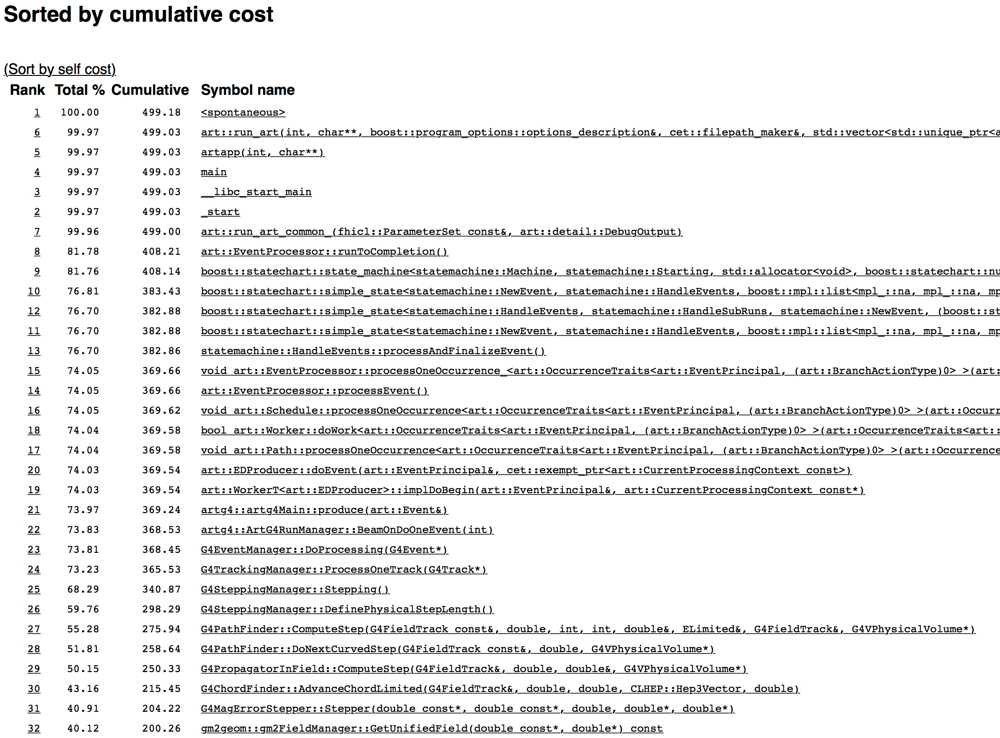
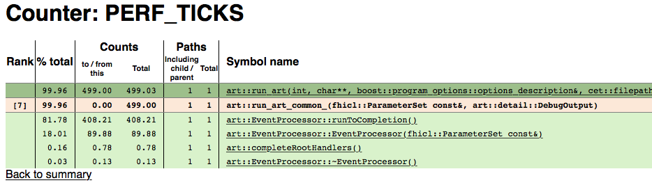
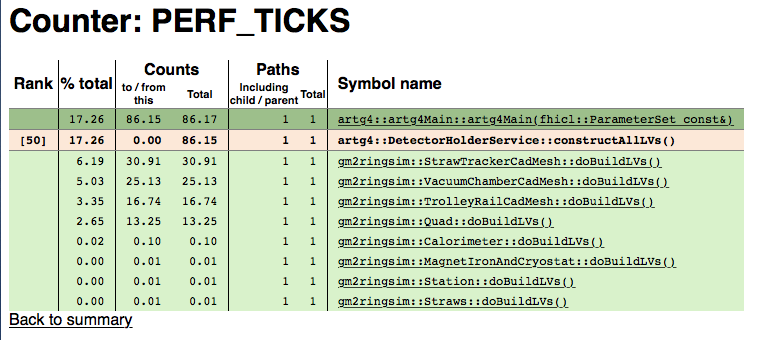
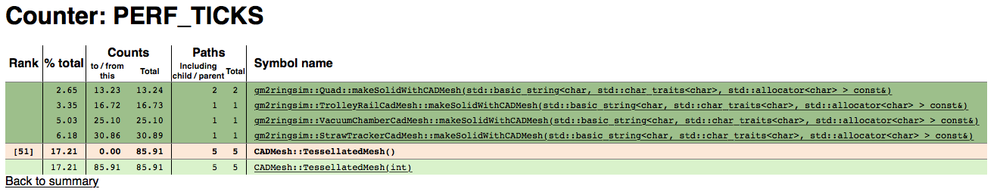
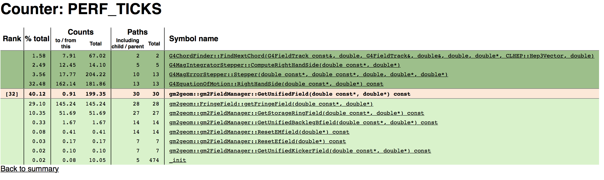
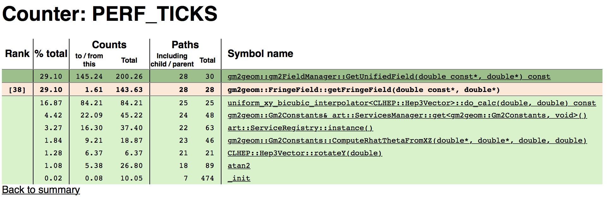
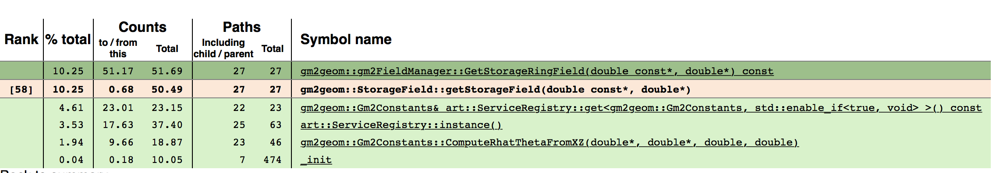

# Time Profiling with igprof

`igprof` (see http://igprof.org) is a powerful profiling application that was originally written for the CMS experiment. `igprof` is available in CVMFS. As of this writing, you can set it up with `setup igprof v5_9_16 -q e10`. 

`igprof` can do time and memory profiling. We will concentrate on the time performance profiling for this chapter. An advantage of `igprof` is that it does not access the source code at all (unlike `allinea`). So you can run `igprof` on releases without having to check out any code. Of course profiling any fixes and changes will require the source code and builds. 

## Running igprof

With an environment already set up, including `igprof` (see above), you can run the time profiling with, for example, ...

```bash
igprof -pp -d -z -t gm2 -o <igprof.pp.gz> gm2 -c theFCL.fcl -n 500
```
The options mean...

* `-pp`  Do time profiling
* `-d` add more details (like demangling c++ names)
* `-z` compress the output
* `-t <app>` only look at a process named `app`
* `-o <file>` write output to `file`
* The rest of the arguments are the program to run with its options

For example,
```bash
igprof -pp -d -z -t gm2 -o v7_05_mdc1_igprof.gz gm2 -c mdc1.fcl -n 500
```

The output file is generally not human readable. You need to run `igprof-analyze` to put it in a more readable form. You can make an ASCII file or an `sqlite` database that can be browsed with another tool. I prefer the latter option and so that process will be explained here. See http://igprof.org/analysis.html and http://igprof.org/text-output-format.html for information about ASCII output. 

To make the database, do,

```bash
igprof-analyse --sqlite -d -g -v <igprof.pp.gz> | sqlite3 <out.db>
```

The options mean...

* `-d -g` and more demangling information
* `-v` verbose mode

For example,
```bash
unsetup python    # the ups python interferes
igprof-analyse --sqlite -d -g -v v7_05_mdc1_igprof.gz | sqlite3 v7_05_mdc1_igprof.db
```

Now that you have the database, you can run `igprof-navigator` to browse the timings with your web browser. To set that up, run,

```bash
igprof-navigator <out.db> -p <port>
``` 

For example,
```bash
igprof-navigator v7_05_mdc1_igprof.db -p 8080
```

The application will print the URL, but note that only the port is correct. You will likely need to port forward to access the web page and do, e.g., `http://localhost:8080`. Be sure to stop the server when you are finished with Ctrl-C. 

## Interpreting igprof timing results from web page

See the previous section for setting up, running `igprof`, and setting up the navigator web server. We'll go through an example using the g-2 simulation program. 

```{r ig-top, echo=FALSE, fig.cap='First page', fig.align='center'}

```

The top web page is shown in Fig. \@ref(fig:ig-top), and it shows the cumulative "cost" of called functions in the program. Cumulative means the time spent in that function in seconds, and *all* of the functions it calls (so the top function takes all of the running time). All of the functions on top are infrastructure for `art`, but those should be really fast. The best strategy is to look for drops in Cumulative time. Where there's a drop means that some code as branched off and is taking time. Let's start with that.

The first drop is between items #7 and #8. Something took almost 90s to run. Let's figure that out. Click on the `7` (or the corresponding name of the function).

```{r ig-7, echo=FALSE, fig.cap='First branch point', fig.align='center', fig.width=8, out.width='90%'}

```
Figure \@ref(fig:ig-7) shows the new page. All of the detailed pages will look like this, so let's go through it. 

* The beige background row is the function under scrutiny (the one you clicked on to get here)
* The rows above (dark green) are functions that call the scrutinized function
* The rows below (light green) are functions that are called by the scrutinized function

The _Rank_ column is only for the scrutinized function and shows where it is in the cumulative timings of all the functions. So `art::run_art_common_` is the 7th most time consuming function of the program.

The _%total_ column shows the fraction of all time of the program spent in that particular function *including* all functions that is calls (cumulative!).

The _Counts_ column shows how many seconds are spent in the function for different circumstances. 

* For the caller functions (dark green), _to/from_ shows the time spent in the caller function waiting for the scrutinized function to return. _Total_ includes the time the caller function takes. 
* For the scrutinized function (beige), _to/from_ shows the time spent only in the scrutinized function alone. _Total_ includes the time in the functions it calls (so `art::run_art_common_` itself takes no time -- all of the time is spent in functions that it calls),
* For the called functions (light green), both columns show the same thing and that's how many seconds are spent in the called function and all functions they call (cumulative). 

The _Paths_ column is not interesting for our purposes here. 

So for our example, the 90 seconds goes into `art::EventProcessor::EventProcessor` - the constructor for `EventProcessor`. The next thing to do is to click on that function and then keep clicking on the 90s function until we see something interesting. It takes many clicks. 

```{r ig-50, echo=FALSE, fig.cap='Detector builders', fig.align='center', fig.width=8, out.width='90%'}

```

We finally get to Fig. \@ref(fig:ig-50) where we see where the 90s goes. It is split among the functions that build detectors when the program starts. As expected, the CadMesh functions take the most time. We could click on the most expensive function `gm2ringsim::StrawTrackerCadMesh`, and see where its time goes. As expected, it's all in CadMesh as shown in Fig. \@ref(fig:ig-51). 

```{r ig-51, echo=FALSE, fig.cap='CadMesh', fig.align='center', fig.width=8, out.width='90%'}

```

So here you see that almost all of the 90s is taken up by `CADMesh::TessellatedMesh` and that's called by various other functions. 

So the upshot here is that the target of work for speedup should be `CADMesh::TessellatedMesh` itself. 

## Another analysis

We've just figured out the cost of staring the simulation. Fortunately, that's a one time cost. Let's go back and look at the main cause of time spent generating events. In Fig. \@ref(fig:ig-7), we see that `art::EventProcessor::runToCompletion` takes up the most time. That is the function that generates events. Anything in here that takes time gets amplified by the number of events the simulation is producing. Let's look to see if anything stands out. Click on `art::EventProcessor::runToCompletion` and keep clicking on the called function that takes the longest. 

```{r ig-32, echo=FALSE, fig.cap='Field Lookups', fig.align='center', fig.width=8, out.width='90%'}

```

Eventually we get to Fig. \@ref(fig:ig-32). We see that `gm2geom::gm2FieldManager::GetUnifiedField` takes up 40% of the running time (200 seconds). It is called by many Geant functions. It then calls several functions in `gm2geom`. The largest ones involve the fringe field and the storage ring field. Let's look at the Fringe field.

```{r ig-38, echo=FALSE, fig.cap='Fringe Field', fig.align='center', fig.width=8, out.width='90%'}

```

Figure \@ref(fig:ig-38) shows `gm2geom::FringeField::getFringeField`. Much time is spent in interpolating. Can we interpolate less? There are also calls getting services and constants. Perhaps those can be cached. 

Let's look at the storage field performance too. 

```{r ig-58, echo=FALSE, fig.cap='Services', fig.align='center', fig.width=8, out.width='90%'}

```

Again, more constants and service handling. Perhaps there are improvements here to be made.

The next step is to look at the code or do further performance testing with allinea (next section).
